# Alur Aplikasi Penilaian Guide Kawasan Besakih

Dokumen teknis: seluruh alur kerja aplikasi, dari staff menekan tombol di
lapangan sampai angka muncul di tab rekap spreadsheet.

Untuk panduan pemakaian sehari-hari (bahasa sederhana), lihat
[`PANDUAN-PEMAKAIAN.md`](PANDUAN-PEMAKAIAN.md).

> Diagram di bawah memakai Mermaid — tampil otomatis di GitHub, GitLab, VS Code
> (ekstensi *Markdown Preview Mermaid*), dan Obsidian.

---

## Daftar isi

1. [Peta besar sistem](#1-peta-besar-sistem)
2. [Alur staff memakai aplikasi](#2-alur-staff-memakai-aplikasi)
3. [Apa yang terjadi saat tombol SIMPAN ditekan](#3-apa-yang-terjadi-saat-tombol-simpan-ditekan)
4. [Daur hidup satu penilaian](#4-daur-hidup-satu-penilaian)
5. [Alur sinkronisasi ke server](#5-alur-sinkronisasi-ke-server)
6. [Penentuan alamat & jenis server](#6-penentuan-alamat--jenis-server)
7. [Alur di sisi server (Apps Script)](#7-alur-di-sisi-server-apps-script)
8. [Alur penyusunan rekap bulanan](#8-alur-penyusunan-rekap-bulanan)
9. [Tiga jalur melihat data](#9-tiga-jalur-melihat-data)
10. [Penyimpanan di perangkat](#10-penyimpanan-di-perangkat)
11. [Alur service worker & pembaruan aplikasi](#11-alur-service-worker--pembaruan-aplikasi)
12. [Jadwal waktu ringkas](#12-jadwal-waktu-ringkas)
13. [Peta berkas](#13-peta-berkas)

---

## 1. Peta besar sistem

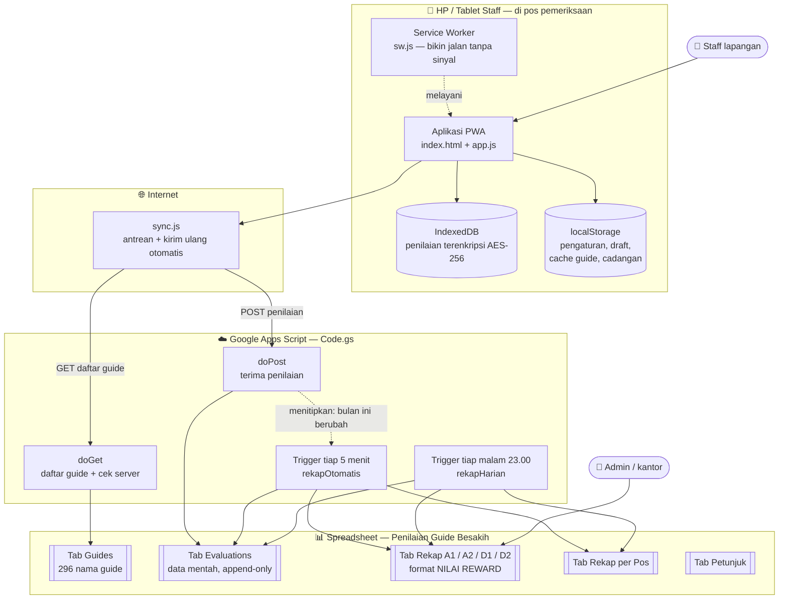

**Inti yang sering disalahpahami:** aplikasi hanya menulis ke **tab
`Evaluations`**. Tab **`Rekap ...`** disusun belakangan oleh trigger, jadi wajar
kalau rekap tertinggal beberapa menit dari data mentahnya.

---

## 2. Alur staff memakai aplikasi

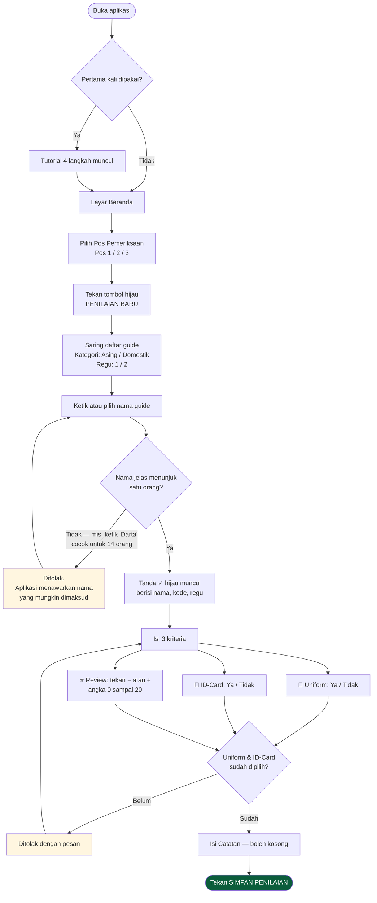

Catatan: **Review boleh 0** dan itu jawaban sah. Yang wajib dipilih hanya
Uniform dan ID-Card.

Selama mengisi, isian disimpan otomatis sebagai **draft** — kalau aplikasi
tertutup tidak sengaja, isian kembali seperti semula saat dibuka lagi.

---

## 3. Apa yang terjadi saat tombol SIMPAN ditekan

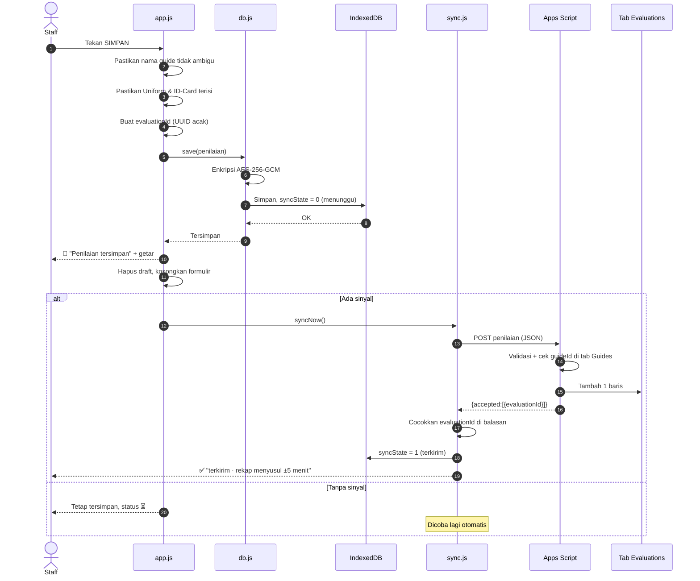

**Yang penting:** status ✅ baru dipasang kalau server **menyebutkan
`evaluationId` itu** dalam balasannya. Balasan "HTTP 200" saja tidak cukup —
Apps Script tetap membalas 200 walau penulisan ke spreadsheet gagal, dan tanpa
pemeriksaan ini data bisa hilang tanpa jejak.

---

## 4. Daur hidup satu penilaian

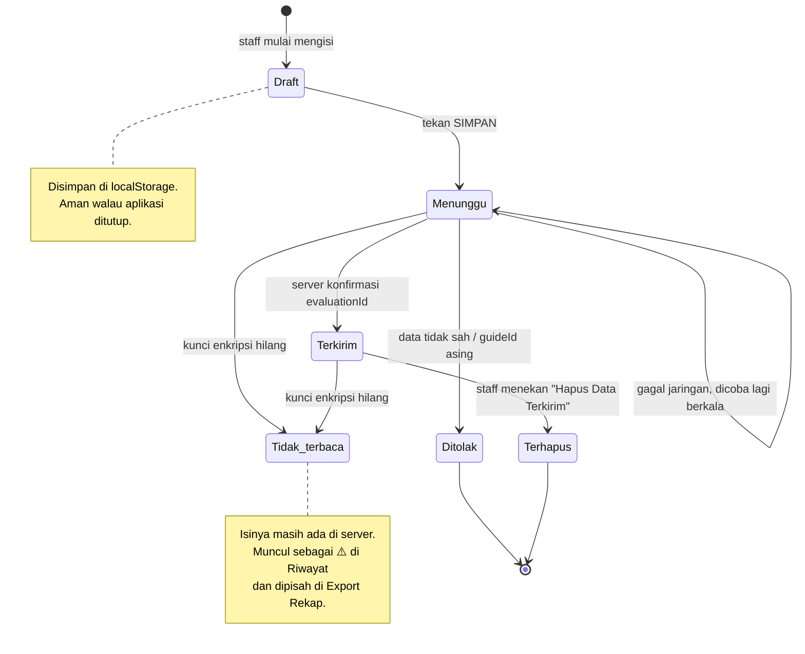

| Status | Tanda di Riwayat | Artinya |
| --- | --- | --- |
| Menunggu | ⏳ | Tersimpan di perangkat, belum sampai server |
| Terkirim | ✅ | Sudah ada di tab `Evaluations` |
| Ditolak | ⏳ + pesan merah | Ada yang salah pada datanya; tidak diulang selamanya |
| Tidak terbaca | ⚠️ | Nilainya tak bisa dibuka di perangkat ini — cek spreadsheet |

---

## 5. Alur sinkronisasi ke server

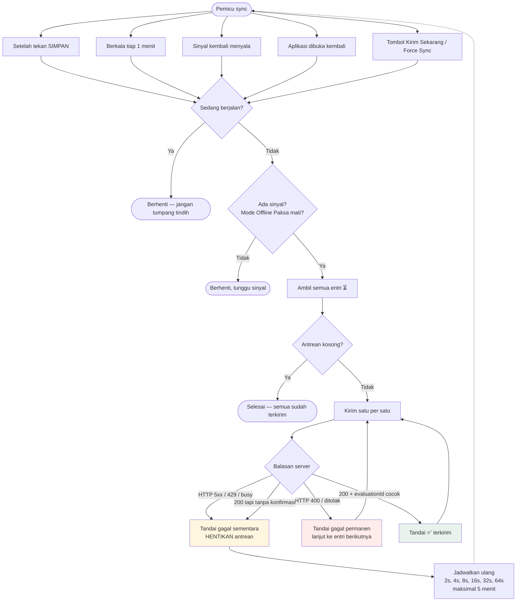

Antrean **dihentikan pada kegagalan jaringan pertama** — kalau jaringannya
memang sedang putus, mencoba 50 entri sisanya hanya membuang baterai. Kiriman
bersifat *idempotent*: mengirim ulang `evaluationId` yang sama tidak
menggandakan baris di spreadsheet.

---

## 6. Penentuan alamat & jenis server

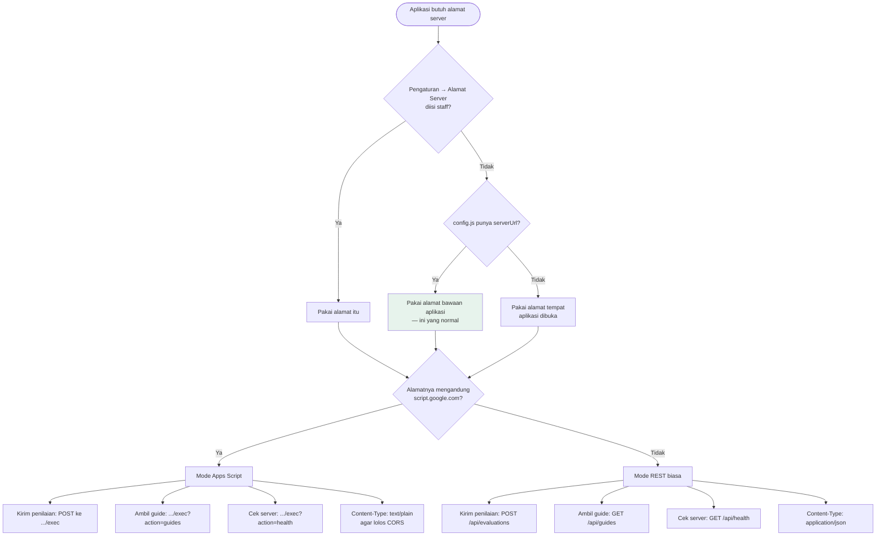

Apps Script tidak bisa menjawab permintaan `OPTIONS`, sehingga
`application/json` akan diblokir CORS. Memakai `text/plain` membuat permintaan
tergolong *simple request* — isi badannya tetap JSON.

---

## 7. Alur di sisi server (Apps Script)

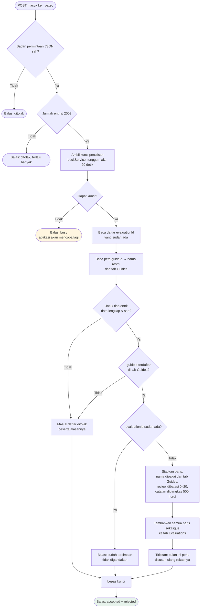

Rekap **tidak** dibangun di sini. Menyusun empat tab regu memakan belasan
detik, sedangkan aplikasi di lapangan menunggu balasan dan akan menganggap
penilaian gagal bila terlalu lama.

---

## 8. Alur penyusunan rekap bulanan

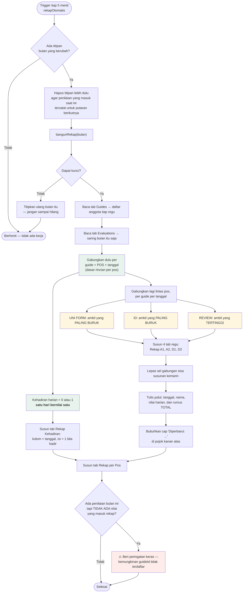

**Kenapa digabung begitu?** Satu guide bisa lewat lebih dari satu pos di hari
yang sama. Kalau di Pos 1 seragamnya lengkap tapi di Pos 3 tidak, yang dicatat
adalah yang tidak lengkap — inilah cara penilaian yang dipakai tim selama ini.
Sebaliknya REVIEW diambil yang tertinggi supaya review yang tercatat di salah
satu pos tidak terhapus.

**Kenapa digabung dua tingkat?** Penggabungan pertama — per guide **per pos**
per tanggal — menghasilkan kolom `Pn Diperiksa` yang menghitung **hari**, bukan
jumlah penilaian. Penggabungan kedua, lintas pos, menghasilkan nilai harian
untuk tab regu sekaligus angka kehadiran.

**Kehadiran bernilai 0 atau 1.** Guide yang melewati tiga pos pada hari yang
sama tetap dihitung hadir satu kali — jalur jalannya saja yang berbeda, bukan
kepatuhannya. Pos mana saja yang memeriksanya tetap terlihat di tab
`Rekap per Pos`.

---

## 9. Tiga jalur melihat data

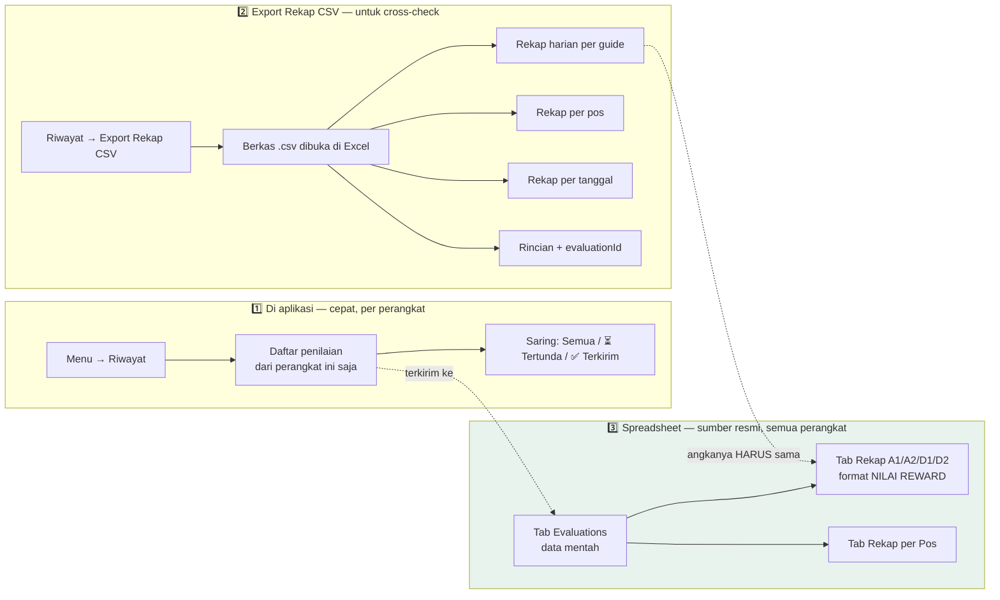

Aturan penggabungan pada **Export Rekap CSV** sengaja dibuat **persis sama**
dengan rekap di spreadsheet. Jadi kalau angkanya berbeda, itu tanda nyata ada
penilaian yang belum sampai ke server — bukan sekadar beda cara menghitung.

---

## 10. Penyimpanan di perangkat

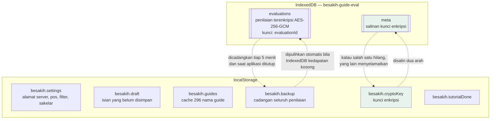

Kunci enkripsi disimpan **di dua tempat**. Dulu kunci hanya ada di
`localStorage` sedangkan datanya di IndexedDB; browser bisa membersihkan
keduanya secara terpisah, dan begitu kunci hilang seluruh penilaian lama
berubah menjadi `(data rusak)` walau isinya masih utuh.

---

## 11. Alur service worker & pembaruan aplikasi

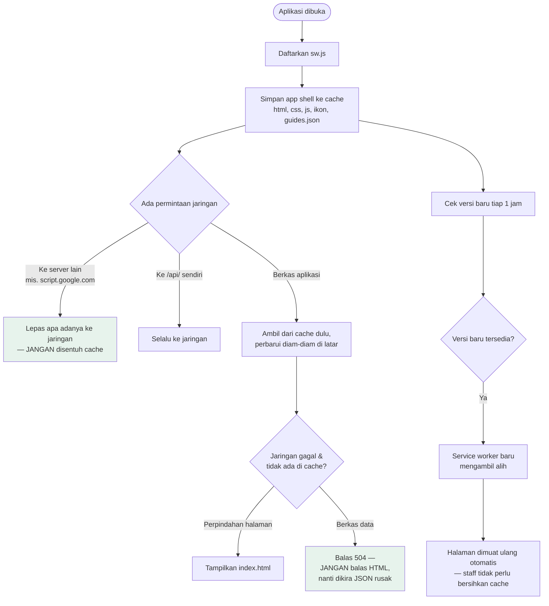

---

## 12. Jadwal waktu ringkas

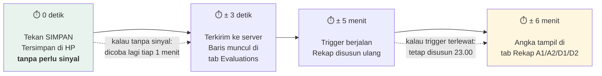

| Peristiwa | Waktu |
| --- | --- |
| Tersimpan di perangkat | seketika, **tanpa perlu sinyal** |
| Masuk tab `Evaluations` | beberapa detik bila ada sinyal |
| Pengiriman ulang berkala | tiap **1 menit** |
| Tab `Rekap ...` disusun ulang | tiap **5 menit**, hanya bila ada data baru |
| Penyusunan menyeluruh | tiap malam **23.00** |
| **Total terburuk** | **± 6 menit** |

---

## 13. Peta berkas

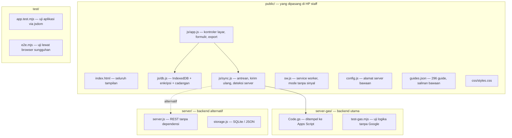

| Perintah | Kegunaan |
| --- | --- |
| `node server/server.js` | Jalankan backend alternatif di komputer sendiri |
| `node server-gas/test-gas.mjs` | Uji seluruh logika Apps Script (57 pemeriksaan) |
| `node test/app.test.mjs` | Uji aplikasi tanpa browser (69 pemeriksaan) |
| `node test/e2e.mjs` | Uji lewat browser sungguhan |

---

## Ringkasan satu kalimat

Staff menekan SIMPAN → penilaian terenkripsi di HP → dikirim saat ada sinyal →
Apps Script memvalidasi dan menambah satu baris di tab `Evaluations` →
trigger 5 menit menyusun ulang tab `Rekap` → admin membaca tab `Rekap`, dan
bisa mencocokkannya dengan **Export Rekap CSV** dari tiap perangkat.
